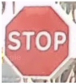
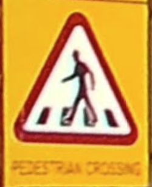
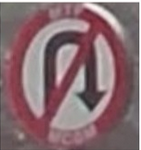
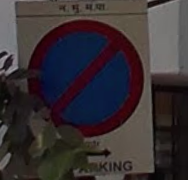
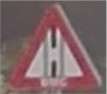

# 🚦 Indian Traffic Sign Classification

A deep learning-based project to classify Indian traffic signs using a fine-tuned ResNet50 model. This project leverages transfer learning, data augmentation, and a two-phase training process to achieve robust performance across 85 traffic sign classes.

## 📌 Project Overview

With the increasing deployment of autonomous driving and intelligent traffic systems, the ability to accurately identify traffic signs is crucial for safety and automation. This project focuses on the classification of Indian traffic signs using a convolutional neural network (CNN) architecture based on ResNet50.

The dataset is sourced from Hugging Face: [`kannanwisen/Indian-Traffic-Sign-Classification`](https://huggingface.co/datasets/kannanwisen/Indian-Traffic-Sign-Classification)

---

## 🔍 Key Features

- ✅ Fine-tuned **ResNet50** architecture for traffic sign classification
- 📚 Support for **85 unique Indian traffic sign classes**
- ♻️ Advanced **data augmentation** for better generalization
- 🧐 Two-phase training: classifier training + full fine-tuning
- ⛑️ Predicts traffic sign class with confidence scores
- 📀 Weights saved as `best_traffic_sign_model_resnet50_finetuned.pth`

---

## 🧑‍🧬 Technologies & Libraries

- 🐍 Python
- 🧱 PyTorch
- 🔍 Torchvision
- ♻️ Albumentations (data augmentation)
- 📊 Matplotlib (for visualization)
- 🧦 ResNet50 (pre-trained model)

---

## ⚧ Challenges & Observations

- Some classes with visually similar signs (e.g., _Pedestrian Crossing_ vs _School Ahead_) led to misclassifications.
- Performance drops with low-resolution or poorly lit images.
- Improvement areas include:
  - Better class separation
  - Training with additional real-world noisy data
  - Adding localization (bounding box) for real-time detection use cases

---

## 🧪 Example Predictions

| Image                                                    | Predicted Class   | Confidence | Notes                   |
| -------------------------------------------------------- | ----------------- | ---------- | ----------------------- |
|                                | STOP              | 0.3815     | Correct, low confidence |
|  | SCHOOL_AHEAD      | 0.6646     | Misclassified           |
|                      | U_TURN_PROHIBITED | 0.4256     | Correct                 |
|                    | NO_PARKING        | 0.5688     | Correct                 |
|              | SIDE_ROAD_LEFT    | 0.2342     | Misclassified           |

---

## 💻 How to Run

1. **Clone the repository:**

   ```bash
   git clone https://github.com/pranavdhawale/itsd.git
   cd itsd
   ```

2. **Install dependencies:**

   ```bash
   pip install -r requirements.txt
   ```

3. **Train the model (optional):**

   ```bash
   python model_training.py
   ```

4. **Run prediction:**
   ```bash
   python predict.py path_to_image.jpg
   ```

---

## 📁 Project Structure

```
├── images
│   ├── no_parking.png
│   ├── parking.png
│   ├── pedestrian_crossing2.png
│   ├── pedestrian_crossing.png
│   ├── speed_breaker.png
│   ├── speed_limit_30.png
│   ├── speed_limit_80.png
│   └── traffic_signal_ahead.png
├── models
│   └── best_traffic_sign_model_resnet50_finetuned.pth
├── model_training.py
├── predict.py
```

---

## 🙌 Acknowledgements

Thanks to [@kannanwisen](https://huggingface.co/kannanwisen) for providing the Indian Traffic Sign dataset. Also, gratitude to my mentors and peers for their constant feedback and support.

---

## 📬 Let's Connect!

Feel free to connect on
[LinkedIn](https://www.linkedin.com/in/pranav-dhawale-324452212/)
or contribute by creating a pull request or issue.

## Contributors

<a href="https://github.com/pranavdhawale">
  
</a>
&nbsp;
<a href="https://github.com/pranavdhawale">
  
</a>
&nbsp;
<a href="https://github.com/pranavdhawale">
  
</a>
&nbsp;
<a href="https://github.com/pranavdhawale">
  
</a>
